# FitFlow — Complete Workflow & Flowcharts

> All system flows, state machines, and process diagrams for FitFlow.

---

## 1. System Architecture

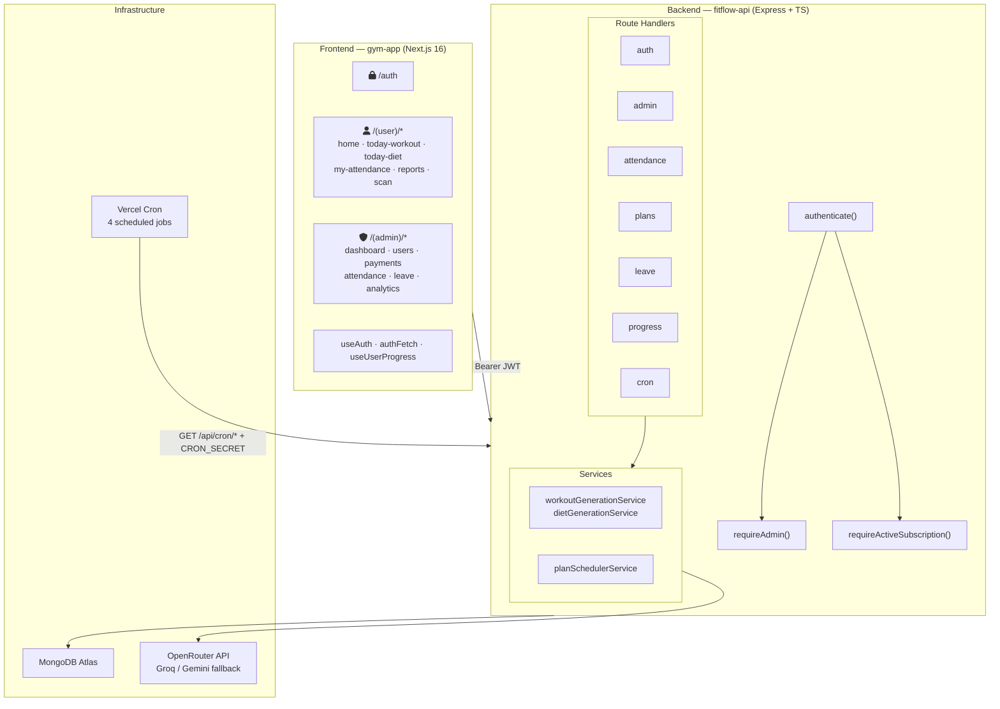

---

## 2. Authentication Flow

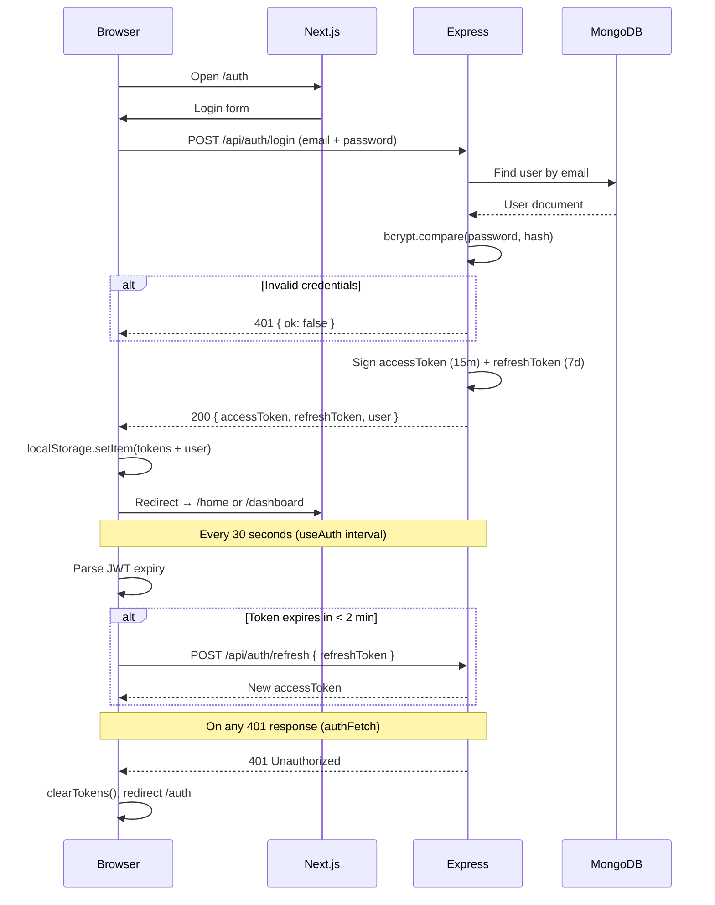

---

## 3. Member Onboarding Flow

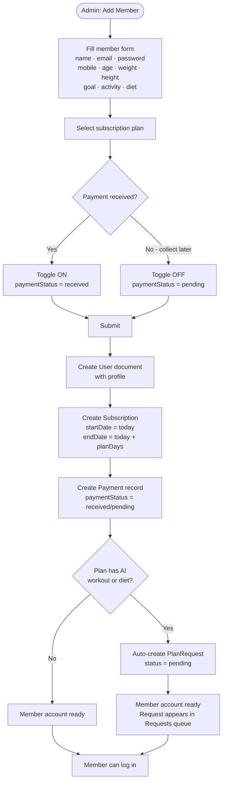

---

## 4. AI Plan Generation Flow

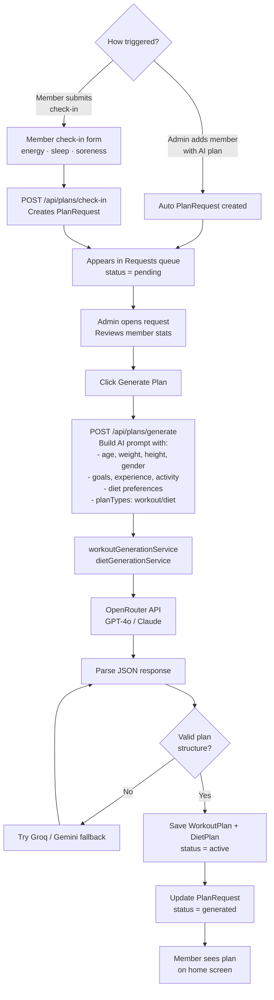

---

## 5. Subscription Lifecycle

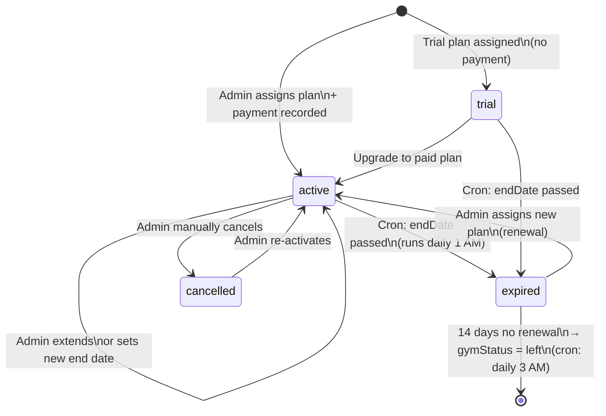

---

## 6. Payment Workflow

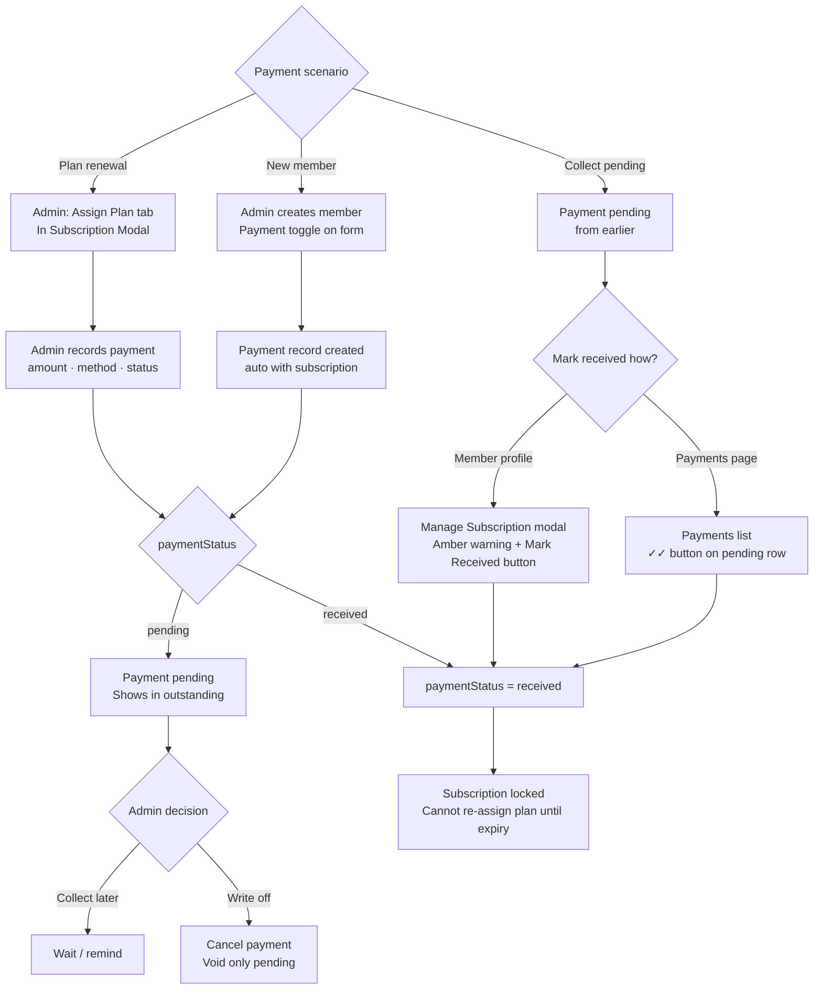

---

## 7. QR Attendance Flow

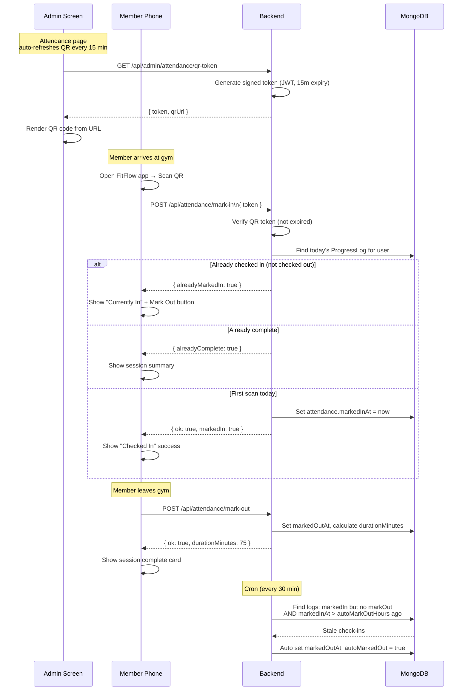

---

## 8. Attendance History — Day Status Logic

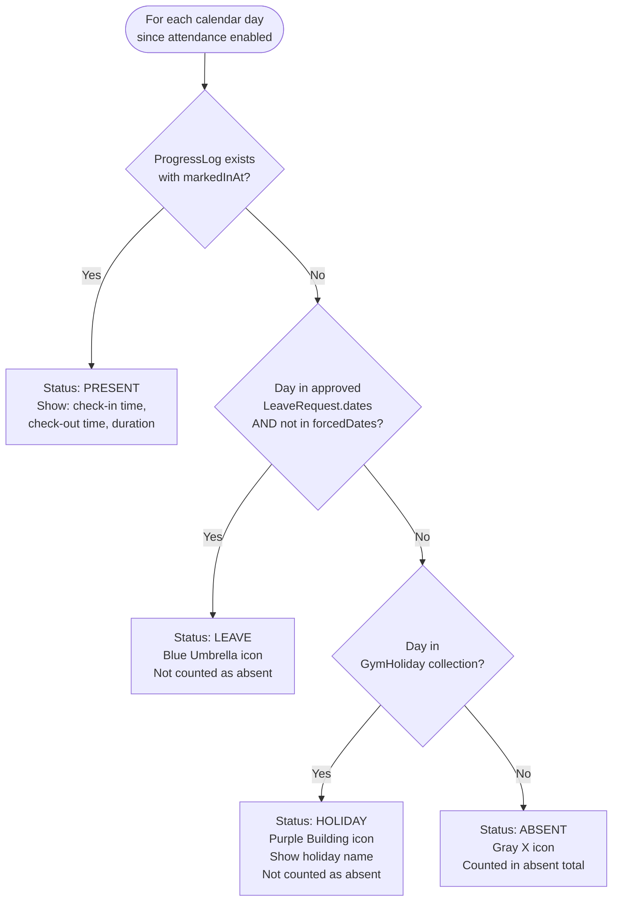

---

## 9. Leave Request Flow

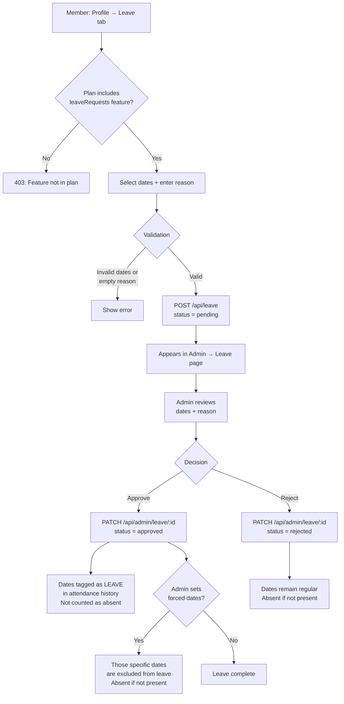

---

## 10. Cron Jobs Schedule

```mermaid
gantt
    title Daily Cron Execution Timeline
    dateFormat HH:mm
    axisFormat %H:%M

    section Scheduled
    subscription-update (expire subs)   :01:00, 10m
    workout-expiry (mark old plans)     :02:00, 5m
    gym-left-update (14d no renewal)    :03:00, 10m

    section Recurring (every 30 min)
    attendance-auto-markout             :00:00, 5m
    attendance-auto-markout             :00:30, 5m
    attendance-auto-markout             :01:00, 5m
```

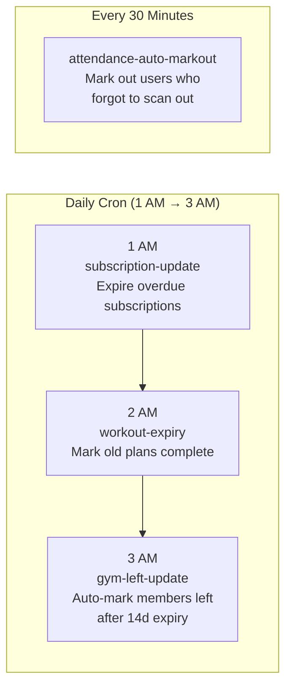

---

## 11. Admin Navigation Map

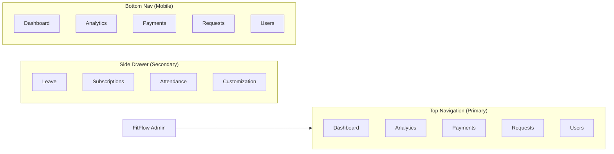

---

## 12. Member Navigation Map

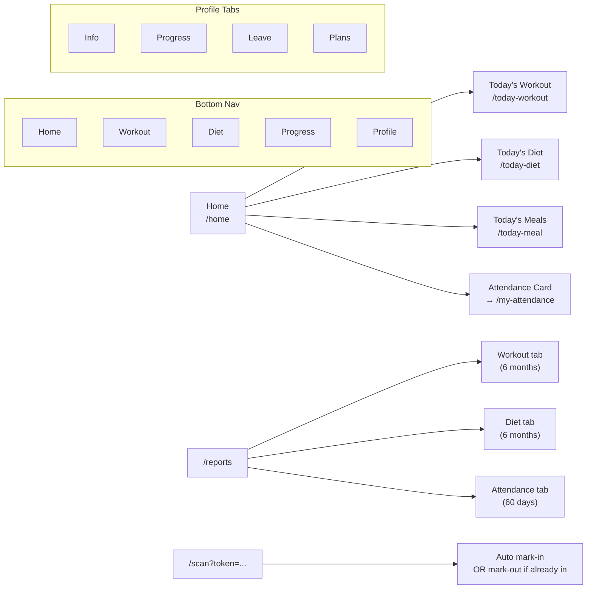

---

## 13. Data Model Relationships

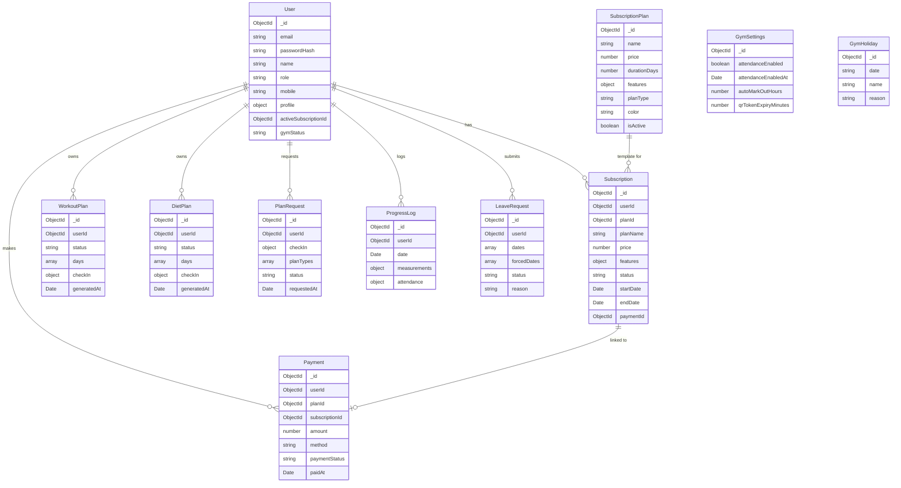
